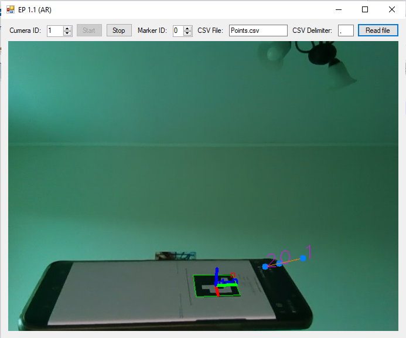

# Инженерный проект за 6 (летний) семестр
### Вариант 1.1 (Применение технологии дополненной реальности для визуализации данных систем управления)
### Задание:

```
1. Применение технологии дополненной реальности для визуализации данных систем
управления
1.1. Визуализация мониторинговых данных функционирования промышленного
оборудования средствами дополненной реальности
Разработать систему, отображающую параметры работы промышленного
робота-манипулятора, в том числе планируемую траекторию движения, с
использованием средств дополненной реальности.
Задано: источник данных – видеофайл или данные с камеры.
Инструментарий разработки: Язык C#, библиотеки OpenCVSharp или
AForgeNET для технического зрения, библиотека SharpGL для визуализации
данных, маркеры дополненной реальности (ARTag, NyARToolkit, ARuco – на
выбор)
Порядок обработки:
- определить пространственную схему размещения визуальных элементов
(виджетов) для отображения мониторинговых данных;
- выполнить покадровое считывание методами openCV или AForgeNET;
- распознать маркер на изображении, вычислить положение системы
координат производственной ячейки относительно изображения
(камеры);
- считать данные с промышленного оборудования и системы управления
(используя инструментарий PCDK или «Интернета вещей»), а также
координаты узловых точек траектории движения (с поддержкой не
менее 10 точек);
- реализовать нанесение мониторинговых данных поверх изображения с
учетом схемы размещения виджетов;
- реализовать отображение планируемой траектории движения в
координатной системе, связанной с опорой робота;
- реализовать показ изображений и сохранения их в виде
видеопоследовательности (видеофайла).

```

### C#. Полностью свободное использование


